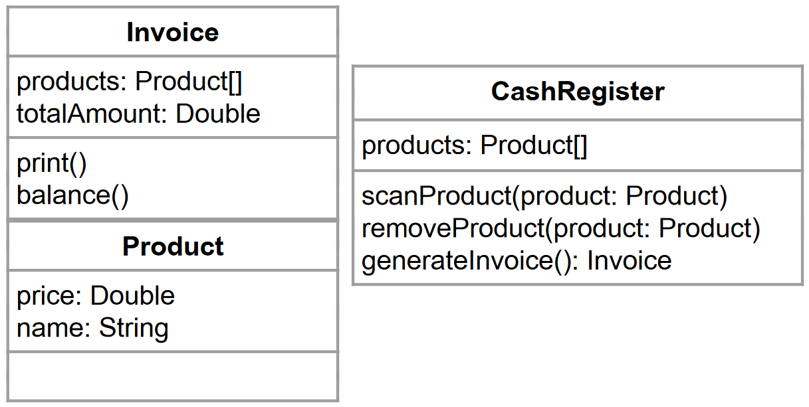

# Klassen, Objekte und Instanzen

Im vorigen Kapitel haben wir festgestellt, was wir jetzt brauchen, um bessere Programme zu schreiben: Klassen, Objekte und deren Instanzen. In diesem Kapitel erklären wir, was diese sind und wie sie angewendet werden. 

In deinem Programm, bevor du anfängst zu programmieren, musst du dir Gedanken darüber machen, wie du dein Programm strukturieren möchtest. Bisher hast du vermutlich alles in einer Datei programmiert. Ab jetzt fangen wir an, größere Programme zu schreiben und uns zu überlegen, wie wir das Ganze in mehreren Dateien aufsplitten, um den Code verständlicher zu gestalten. 

In deinem Entwicklerleben wirst du in Unternehmen selten alleine arbeiten, erstens wirst du vermutlich nicht alleine an einem Programm arbeiten, zweitens ist es in Unternehmen so, dass es eine Gefahr birgt, wenn ein\*e Mitarbeiter\*in alleinwissend über ein Programm ist. So hat jedes Unternehmen eine Vertretungsregelung und diese Vertretung muss deinen Code verstehen können. Hier spielen mitdestens die folgenden 2 Parameter eine Rolle:
- Clean Code/Namenskonventionen/...
- Struktur

Ersteres haben wir im Abschnitt 05 bereits erläutert. 

## Struktur eines Programms und Modellierung der Aufgabe

Jetzt konzentrieren wir uns auf die Struktur. Dafür nehmen wir ein Beispiel:

Wir modellieren den Kassaablauf in einem Supermarkt. Die Kassa soll folgende Funktionen haben:
- Produkte scannen
- Produkte stornieren
- Rechnung drucken

Aus der Angabe können wir erkennen, dass es im Supermarkt Produkte, eine Kassa gibt und die Kassa soll den Kunden eine Rechnung drucken. Das heißt, wir werden 3 Entitäten benötigen:
- Produkt
- Rechnung
- Kassa

Jetzt nehmen wir jede Entität und überlegen, welche Eigenschaften diese Entität hat:

- Produkt: 
  - Bezeichnung
  - Produktnummer/BarCode/QRCode
  - Preis
- Rechnung:
  - Liste der gekauften Produkte
  - Gesamtpreis
- Kassa:
  - Liste aller Produkte

Für unsere Anwendung reichen diese Eigenschaften. In der Softwareentwicklung macht es wenig Sinn, mehr Eigenschaften zu definieren als tatsächlich für die Anwendung benötigt wird.

Weiters müssen wir uns jetzt je Entität überlegen, welche Funktionen/Fähigkeiten jede Entität haben soll.

- Produkt: 
  - eigentlich keine Funktion. Diese Entität tut selbst nichts, hat daher nur Eigenschaften.
- Rechnung:
  - Rechnungsgesamtbetrag berechnen
  - Rechnung drucken
- Kassa:
  - Produkt scannen
  - Produkt löschen
  - Rechnung erstellen

Wir haben also 3 Entitäten modelliert. In der Softwareentwicklung ist es Standard, dass alle Entitäten, Attribute und Methoden englische Bezeichnungen haben. Das ergibt:



Im nächsten Schritt müssen wir die sogenannten **Klassen** aufgrund dieses Modells definieren. Eine Klasse ist eine Blaupause für ein Objekt, in dem Sinne, dass diese definiert, welche Attribute das Objekt hat, welchen Datentyp die Attribute haben und welche Methoden das Objekt anbietet. Ein **Objekt** ist also immer eine **Instanz** einer Klasse.

In den bisherigen Kapiteln haben wir bereits ein Paar Objekte kennengelernt:
- ArrayList, LinkedList, SortedList
- HashSet, HashMap

Das sind vordefinierte Klassen. Es besteht auch die Möglichkeit eigene Klassen zu definieren. 

## Woraus besteht eine Klasse?

Eine Klasse besteht aus folgenden Elementen:
- (optional) Zuweisung zu einem Package bzw. Import von benötigten Packages
- eine Klassendefinition
- Attribute
- (optional) Konstruktor(en). Optional, da eine Klasse ohne Konstruktor implizit einen parameterlosen Konstruktor annimmt, der nichts tut.
- (optional) Getter und Setter
- Methoden

### Package

Bei der Erstellung einer Klasse kann man als Erstes (ganz oben in der Datei) definieren, in welchem Package diese Klasse zu finden sein soll. Dies ist optional, macht aber in vielen Fällen Sinn, damit der Code in anderen Programmen wiederverwendet werden kann.

Ein Package ist nichts anderes als Container mit einem Namen, der mehrere Klassen, die thematisch/technisch gut zusammenpassen, zusammenfasst. Alle vordefinierten Klasse in Java/C# sind in Packages verpackt.

Im folgenden Beispiel definierst du, dass deine Klasse in das Package at.codersbay.mypackage gehört. 

Der Name eines Package wird sehr häufig so definiert wie die umgekehrte URL ohne www der Firma:
Die URL der CODERS.BAY lautet www.codersbay.at also würde das Package *at.codersbay* (wird auch namespace genannt) und anschließend der Name, den du für dein Package selbst definieren möchtest (sofern deine Firma dafür keine Vorgabe macht). In unserem Fall wählen wir *mypackage*.

So sieht die Deklaration in Java und C# aus:

#### Java 

```Java
package at.codersbay.mypackage;
```
#### C# 

```c#

```

Vor der Klassendefinition kann man auch bestehende Packages importieren, um diese im Code nutzen zu können. 

## Java

```Java
import at.codersbay.mypackage.*;
import at.codersbay.mypackage.MyClass
```

## C#

```c#

```

## Klassendeklaration

Die Klassendeklaration erfolgt wie folgt:

### Java 

```Java
public class MyClass{
    [Attribute]

    [Konstruktor(en)]

    [Getter/Setter]
    
    [Methoden]
}
```
### C# 

```c#

```

Wie du erkennen kannst, sind ein Paar Elemente der Deklaration zu erkennen, die wir von den Methoden kennen:
- **Access Modifier**: auch hier spielen Access Modifier eine Rolle. So kannst du definieren, ob eine Klasse:
  - öffentlich (**public**), 
  - innerhalb des  Packages und der Subklassen (**protected**) oder 
  - nur im Package (**default** bzw. kein Access Modifier) erreichbar.
- **andere Modifier**: 
  - **kein Modifier**: ist der Standard (Siehe Beispiel oben)
  - **final**: die Klasse kann nicht vererbt werden. Der Vererbung von Klassen widmen wir uns in einem späteren Kapitel
  - **abstract**: eine spezielle Art von Klassen, aus denen kein Objekt instanziert werden kann. Diese Art Klassen dienen als Vorlage für weitere Klassen. Diesem Thema widmen wir uns in einem späteren Kapitel.
- **Klassenname**: wie soll die Klasse heißen? Laut Namingkonventionen fangen Klassennamen in Java immer mit einem Großbuchstaben an bzw. der ganze Name wird in Pascal case geschrieben.

[Zurück zur Übersicht](README.md)