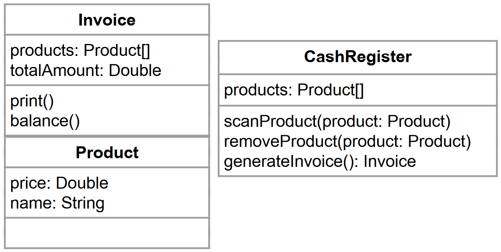

# Klassen, Objekte und Instanzen

In der Problemstellung haben wir festgestellt, dass wir mehr brauchen, um bessere Programme zu schreiben: Klassen, Objekte und deren Instanzen. In diesem Kapitel erklären wir, was diese sind und wie sie angewendet werden. 

Klassen und Objekte sind die Basis einer jeden objektorientierten Programmiersprache. Alles basiert auf `Klassen`. Eine erste Klasse hast du bereits kennengelernt: die Main-Klasse. Sie ist der Startpunkt eines jeden Programms.

In deinem Programm, bevor du anfängst zu programmieren, musst du dir Gedanken darüber machen, wie du dein Programm strukturieren möchtest. Bisher hast du vermutlich alles in einer Datei programmiert. Ab jetzt fangen wir an, größere Programme zu schreiben und uns zu überlegen, wie wir das Ganze in mehreren Dateien aufsplitten, um den Code verständlicher zu gestalten. 

In deinem Entwicklerleben wirst du in Unternehmen selten alleine arbeiten, erstens wirst du vermutlich nicht alleine an einem Programm arbeiten, zweitens ist es in Unternehmen so, dass es eine Gefahr birgt, wenn ein:e Mitarbeiter:in alleinwissend über ein Programm ist. So hat jedes Unternehmen eine Vertretungsregelung und diese Vertretung muss deinen Code verstehen können. Hier spielen mindestens die folgenden 2 Parameter eine Rolle:
- Clean Code/Namenskonventionen/...
- Struktur

Ersteres haben wir im Abschnitt 05 bereits erläutert. 

## Struktur eines Programms und Modellierung der Aufgabe

Jetzt konzentrieren wir uns auf die Struktur. 

Dafür nehmen wir ein Beispiel:

Wir modellieren den Kassaablauf in einem Supermarkt. Die Kassa soll folgende Funktionen haben:
- Produkte scannen
- Produkte stornieren
- Rechnung drucken

Aus der Angabe können wir erkennen, dass es im Supermarkt Produkte, eine Kassa gibt und die Kassa soll für den Kunden und für die Buchhaltung eine Rechnung drucken. Das heißt, wir werden 3 Entitäten benötigen:
- Produkt
- Rechnung
- Kassa

In einem 2. Schritt überlegen wir für jede Entität, welche Eigenschaften diese Entität hat:

- Produkt: 
  - Bezeichnung
  - Preis
  - ev. Produktnummer/BarCode/QRCode
  - ...
- Rechnung:
  - Liste der Produkte
  - ev. Rechnungsbetrag
  - ...
- Kassa:
  - Liste aller Produkte

Für unsere Anwendung reichen die genannten Eigenschaften aus. In der Softwareentwicklung definiert man immer nur jene Eigenschaften, die tatsächlich für die Anwendung benötigt werden. Alles andere wurde unnötig Speicher verbrauchen und die Code-Komplexität erhöhen. 

Um das Beispiel zu vereinfachen, vernachlässigen solche Themen wie MwSt bzw. fassen jene Produkte nicht zusammen, die mehrfach gekauft wurden.

In einem 3. Schritt überlegen wir je Entität, welche Funktionen/Fähigkeiten jede Entität haben soll.

- Produkt: 
  - eigentlich keine Funktion. Diese Entität tut selbst nichts, hat daher nur Eigenschaften.
- Rechnung:
  - Rechnungsgesamtbetrag berechnen
  - Rechnung drucken
- Kassa:
  - Produkt scannen (Produkt auf die Rechnung schreiben)
  - Produkt löschen
  - Rechnung erstellen

Wir haben also 3 Entitäten modelliert. In der Softwareentwicklung ist es Standard, dass alle Entitäten, Attribute und Methoden **englische Bezeichnungen** haben. Das ergibt:



Jetzt sind wir bereit die entsprechenden **Klassen** aufgrund dieses Modells zu definieren. Eine Klasse ist eine Blaupause für ein Objekt. Diese definiert, welche Attribute das Objekt hat, welchen Datentyp die Attribute haben und welche Methoden das Objekt anbietet. Ein **Objekt** ist also immer eine **Instanz** einer Klasse.

In den bisherigen Kapiteln haben wir bereits einige Objekte kennengelernt:
- ArrayList, LinkedList, SortedList
- HashSet, HashMap

Das sind vordefinierte Klassen. 

Objektorientierte Programmiersprache bieten nicht nur vordefinierte Klassen. Sie biete auch die Möglichkeit eigene Klassen zu definieren. 

## Woraus besteht eine Klasse?

Jede Klasse wird in einer eigenen Datei gespeichert, welche den Namen der Klasse trägt (Dies ist eine Coding-Convention und ist nicht technisch notwendig, sondern für die Lesbarkeit notwendig). In Ausnahmefällen kann eine Klasse innerhalb einer anderen Klasse definiert werden. Dies kommt aber selten vor, daher werden wir diesen Fall hier nicht näher behandeln.

Eine Klasse besteht aus folgenden Elementen:
- (optional) Zuweisung zu einem `Package` 
- (Optional) Import von benötigten Packages
- eine `Klassendefinition`
- `Attribute`
- (optional) `Konstruktor(en)`. Optional, da eine Klasse ohne Konstruktor implizit einen parameterlosen Konstruktor annimmt, der nichts tut.
- (optional) `Getter` und `Setter`
- `Methoden`

### Package

Bei der Erstellung einer Klasse kann man als Erstes (ganz oben in der Datei) definieren, in welchem Package diese Klasse zu finden sein soll. Dies ist optional, macht aber in vielen Fällen Sinn, damit der Code in anderen Programmen wiederverwendet werden kann.

Ein Package ist nichts anderes als Container mit einem Namen, der mehrere thematisch/technisch gut zusammenpassenden Klassen, zusammenfasst. Alle vordefinierten Klassen in Java/C# sind in Packages verpackt.

Im folgenden Beispiel definierst du, dass deine Klasse in das Package `at.codersbay.mypackage` gehört. 

Der Name eines Package wird sehr häufig so definiert wie die umgekehrte URL ohne www der Firma:
Die URL der CODERS.BAY lautet `www.codersbay.at` also würde das Package `at.codersbay` (wird auch namespace genannt) und anschließend der Name, den wir für das Package selbst definieren möchtest (sofern die Firma dafür keine Vorgabe macht). In unserem Fall wählen wir `mypackage`.

So sieht die Deklaration in Java und C# aus:

```Java
// Java 
package at.codersbay.mypackage;
```

```csharp
// C#
namespace At.CodersBay.MyNamespace {}
```

In C# wird der `Namespace` als Container der Klasse definiert. In Java wird das `Package` in der ersten Zeile der Datei definiert.

Vor der Klassendefinition kann man auch bestehende Packages importieren, um diese im Code nutzen zu können. 

```Java
// Java
import at.codersbay.mypackage.*; // Alle Klassen eines Packages sind im Programm verfügbar
import at.codersbay.mypackage.MyClass; // Nur die Klasse `MyClass` ist im Programm verfügbar
```

```csharp
// C#
namespace At.CodersBay.MyNamespace {...}
```

Da der `Namespace` in C# als Container für die Klasse definiert wird, werden die `using`-Statements zuerst definiert. In Java ist es umgekehrt.

Zum besseren Verständnis hier noch ein Beispiel, das all diese Bestandteile verwendet:

```Java
// Java
package at.codersbay.mypackage;

import java.util.HashMap;

class MyClass {
  ... // Hier kommt die Definition der Klasse, siehe weiter unten
}
```

```csharp
// C# 
using System.Collections.Generic;

namespace At.CodersBay.MyNamespace {
  class MyClass {
    ... // Hier kommt die Definition der Klasse, siehe weiter unten
  }
}
```

## Klassendeklaration

Die Klassendeklaration erfolgt wie folgt:

```Java
// Java
public class MyClass{
    [Attribute]

    [Konstruktor(en)]

    [Getter/Setter]
    
    [Methoden]
}
```

```csharp
// C# 
public class MyClass {
    [Attribute]

    [Konstruktor(en)]

    [Getter/Setter]
    
    [Methoden]
}
```

Wie du erkennen kannst, sind ein Paar Elemente der Deklaration zu erkennen, die wir von den Methoden kennen:
- **Access Modifier** für Klassen: auch hier spielen Access Modifier eine Rolle. So kannst du definieren, ob eine Klasse:
  - Öffentlich (`public`) oder
  - Innerhalb des Packages/Namespaces und der Subklassen (`protected`) oder 
  - Nur im Package/Namespace (`default` bzw. kein Access Modifier) erreichbar.
  - Der Access Modifier `private` macht für eine Klassendefinition wenig Sinn, da die Klasse für andere Klassen nicht erreichbar wäre. Das ist aber der Sinn einer Klasse, dass sie von anderen Klassen verwendet werden kann.
- **andere Modifier** für Klassen: 
  - **kein Modifier**: Die meisten Klassen werden so definiert. Das sind Klassen, die instanziert und vererbet werden können (Das Thema Vererbung schauen wir uns in einem späteren Kapitel an)
  - `final`: Die Klasse kann nicht vererbt werden. Der Vererbung von Klassen widmen wir uns in einem späteren Kapitel.
  - `abstract`: Eine spezielle Art von Klassen, aus denen kein Objekt instanziert werden kann. Dieser Klassentyp dient als Vorlage für Subklassen. Diesem Thema widmen wir uns in einem späteren Kapitel.
- `Klassenname`: In unserem Beispiel: `MyClass`. Dies ist der Name, mit dem die Klasse aufgerufen werden kann. Laut Namingkonventionen fangen Klassennamen in Java und C# immer mit einem Großbuchstaben an bzw. der ganze Name wird in Pascal case geschrieben.

[Zurück zur Übersicht](README.md)