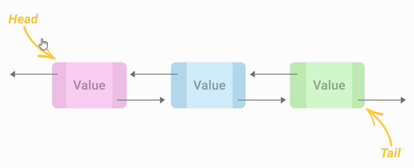

# Aufgabenstellungen

## Aufgabe 1: verkettete Liste
Wie auch Arrays ist die verkettete Liste eine lineare Datenstruktur, allerdings besteht die verkettete Liste aus einzelnen Elementen (Nodes) die durch Zeiger miteinander verbunden sind.


Um die Liste zu implementieren benötigst du 2 Klassen. Die Klasse Node (im Bild A, B, ..) hat ein Attribut '''value''' (z.B.: vom Typ String) und einen Zeiger vom Typ '''Node''' auf das nächste Element. Die zweite Klasse ist die Liste selbst. Hier implementieren wir alle Funktionen die unsere Liste haben soll.

Folgene Funktionalität sollte unsere Liste zumindest haben:
(Siehe auch Java List Interface: https://docs.oracle.com/javase/8/docs/api/java/util/List.html)
```
 boolean add(E e)
 void    add(int index, E element)
 int     size()
 E       get(int index)
 E       remove(int index)
```

Zusätzlich:
```
String  toString() # Return a string representing the values of the list properly formated 
```

Für diese Aufgabe benötigst du KEINE anderen Datenstrukturen (Arrays, ArrayList, etc.).

Hier ein einfaches Beispiel für die Grundstruktur: https://www.geeksforgeeks.org/linked-list-set-1-introduction/

**Bonus:** Du kannst deine Liste mit Generics(https://www.geeksforgeeks.org/generics-in-java/) implementieren, sodass der Typ des gespeicherte Wertes **value**, beim erstellen der Liste dynamisch angegeben werden kann.

## Aufgabe 2: doppelt verkettete Liste
Eine doppelt verkettete Liste ist eine Reihe von Elementen (auch Knoten/Nodes genannt), die durch zwei Zeiger miteinander verbunden sind. Zusätzlich zu einem Zeiger, der auf das nächste Element zeigt gibt es einen, der auf das vorhergehende Element zeigt. Eine doppelt verkettete Liste kann man also in beide Richtungen durchlaufen. Die Operationen auf einer doppelt verketteten Liste sind analog zu denen einer einfach verketteten Liste.



Folgene Funktionalität sollte unsere Liste zumindest haben:
(Siehe auch Java List Interface: https://docs.oracle.com/javase/8/docs/api/java/util/List.html)

```java
 boolean add(E e)
 void    add(int index, E element)
 int     size()
 E       get(int index) 
 E       remove(int index)
```

Zusätzlich:
```java
 String  toString() // Return a string representing the values of the list properly formated
 String  toStringReverse() // Output the elements expected from toString in reverse
```

Wie auch bei der einfach verketteten Liste kannst du gerne Generics verwenden.

## Aufgabe 3: Fotografie

Implementiere die Klassen *Camera* und *Lens*. Eine Kamera besitzt einige Eigenschaften - eine Marke *brand*, eine Anzahl an MegaPixeln *megaPixels*, eine Display Größe *displaySize* und ein boolsches lag, welches ausdrückt ob die Kamera schwarz-weiß oder Farb-Fotos aufnimmt *colored*. Außerdem besitzt eine Kamera ein Objektiv *Lens* welches eine minimale und maximale Brennweite besitzt.

Verwende bei allen Variablen *getter & setter*. Füge beim Setzen der Brennweiten eines Objektivs bzw beim Konstruieren eines Objektivs einen Check hinzu, dass die maximale Brennweite immer größer sein muss als die angegebene minimale Brennweite.

Implementiere *statische* Zählervariablen für die Kamera und für das Objektiv, die mitzählen wieviele Instanzen einer Klasse angelegt wurden.

Lege in der Main Klasse mehrere Kameras an und wechsle auch auf mindestens einer das Objektiv. Überschreibe die *toString()* Methoden beider Klassen.


[Zurück zur Übersicht](README.md)